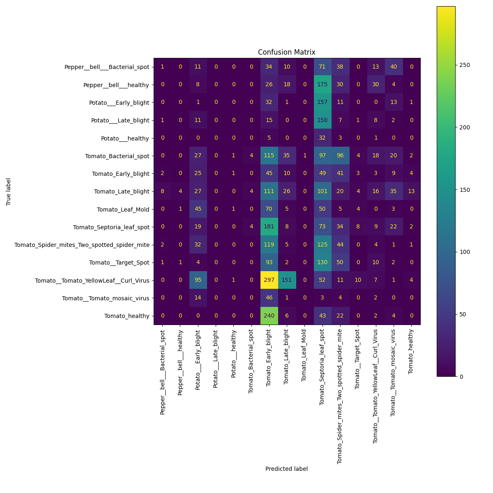

# Plant Disease Detection App

[🌐 Live Demo on Streamlit Cloud](https://plant-disease-detection-app-liquiduck.streamlit.app/)

This repository provides a lightweight demo for identifying common plant diseases from a photograph of a leaf. The application is packaged as a [Streamlit](https://streamlit.io/) web app and uses a small ResNet-18 model for inference.

## Overview
- Upload an image of a leaf in the browser
- The model predicts one of the known diseases or a healthy class
- Runs completely offline using the pretrained model included in this repo

## Requirements
- Python 3.8 or later
- Packages listed below

### Install dependencies
```bash
pip install streamlit torch torchvision pillow
```

## Usage
1. Clone this repository or download the files.
2. Launch the app:
```bash
streamlit run app.py
```
3. A browser window opens where you can upload a leaf photo and view the prediction confidence.

## Repository Contents
- `app.py` – Streamlit user interface and prediction code
- `plant_disease_resnet18.pth` – weights for a ResNet‑18 model trained on an open dataset
- `class_names.json` – mapping from class index to human readable label
- `LICENSE` – project license (MIT)

## Model Details
The included network recognizes 15 diseases affecting peppers, potatoes, and tomatoes. Training was performed with PyTorch using images from the PlantVillage dataset. The weights are provided for demo purposes only and may not generalize to all conditions.

## Model Confusion Matrix


## License
This project is released under the MIT License. See `LICENSE` for the full text.
